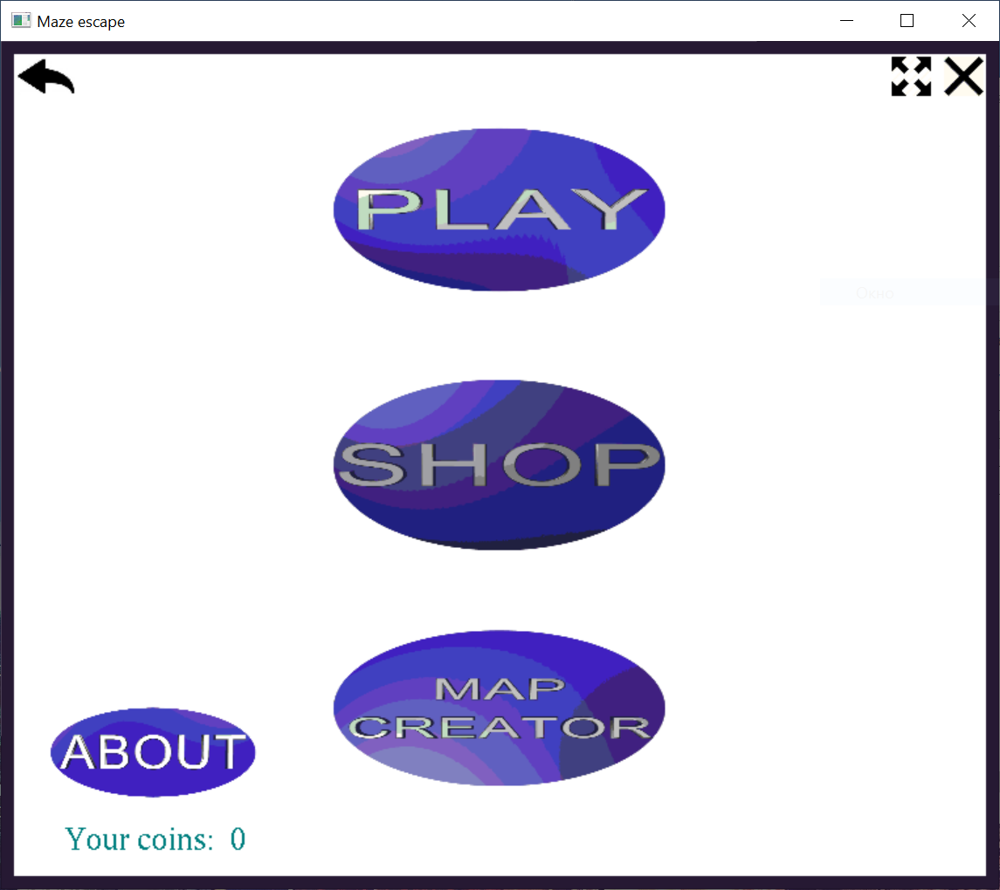

# MazeEscape

Игра-лабиринт написаная на C/C++ с использованием OpenGL.

> Для запуска игры необходимо скачать архив, перейти в папку `MazeEscape` и запустить файл `MazeEscape.exe`.

Главное меню игры:

Лабиринт открывается по ходу прохождения уровня:

Внутри карты случайным образом размещаются монетки, за которые в магазине можно увеличить базовый радиус видимости а также купить другие скины.

У каждого уровня есть статистика прохождения, а также лучшее время.

Также в игре есть возможность создавать собственные уровни с помощью редактора:

> Все иконки сделаны с помощью приложения Aurora 3D Text & Logo Maker